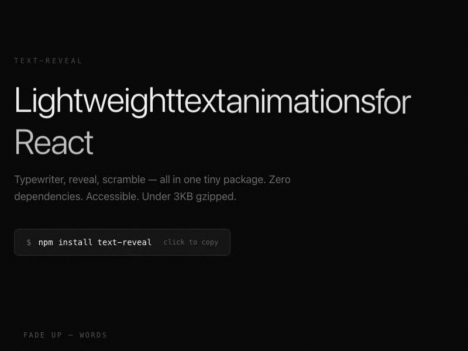

<p align="center"></p>

<h1 align="center">text-reveal</h1>

<p align="center">
  Lightweight text animation primitives for React.<br/>
  Typewriter. Reveal. Scramble. All in one tiny package.
</p>

<p align="center">
  <a href="https://www.npmjs.com/package/reveal-text"></a>
  
  
</p>

<p align="center">
  <a href="https://reveal-text.mulkatz.dev"><strong>Live Demo</strong></a>
</p>

<p align="center">
  
</p>

## Why text-reveal?

- **All-in-one**: Typewriter + split-text reveal + scramble in a single package
- **Zero dependencies**: Pure CSS animations + lightweight JS. No Framer Motion, no GSAP
- **Accessible**: `aria-label` on containers, `aria-hidden` on animated spans. Screen readers get clean text
- **Tiny**: Under 3KB gzipped
- **Hooks-first**: Composable `useTextReveal`, `useTypewriter`, `useScramble` hooks
- **11 presets**: Drop-in `<TextReveal>` component with curated animations
- **Scroll-triggered**: Built-in IntersectionObserver support

## Install

```bash
npm install reveal-text
```

## Quick Start

### Hooks (full control)

```tsx
import { useTextReveal, useTypewriter, useScramble } from "reveal-text";

// Split-text reveal with staggered animation
function Hero() {
  const { ref } = useTextReveal("Build something beautiful.", {
    split: "word",      // "char" | "word" | "line"
    effect: "fade-up",  // "fade-up" | "fade-down" | "fade-in" | "blur-in" | "slide-up" | "slide-down"
    stagger: 60,        // delay between segments (ms)
    duration: 500,      // animation duration (ms)
  });

  return <h1 ref={ref} />;
}

// Typewriter with multiple strings
function Tagline() {
  const { ref } = useTypewriter(
    ["Ship fast.", "Stay accessible.", "Keep it light."],
    { speed: 50, cursor: true, loop: true }
  );

  return <p ref={ref} />;
}

// Text scramble / decrypt effect
function Reveal() {
  const { ref } = useScramble("Secret message unlocked.", {
    speed: 25,
    duration: 1200,
  });

  return <p ref={ref} />;
}
```

### Component (quick & easy)

```tsx
import { TextReveal } from "reveal-text";

<TextReveal preset="fade-up-word" as="h1">
  Every word fades up.
</TextReveal>

<TextReveal preset="blur-in-char" as="h2">
  Each character emerges from blur.
</TextReveal>

<TextReveal preset="typewriter" as="p" speed={40} cursor>
  Typed out character by character.
</TextReveal>

<TextReveal preset="scramble" as="p" duration={1000}>
  Scrambled then revealed.
</TextReveal>
```

## Presets

| Preset | Effect | Split |
|--------|--------|-------|
| `fade-up-word` | Fade + translate up | word |
| `fade-up-char` | Fade + translate up | char |
| `fade-down-word` | Fade + translate down | word |
| `fade-in-word` | Opacity fade | word |
| `fade-in-char` | Opacity fade | char |
| `blur-in-word` | Blur + fade | word |
| `blur-in-char` | Blur + fade | char |
| `slide-up-word` | Slide from below | word |
| `slide-up-line` | Slide from below | line |
| `typewriter` | Character typing | - |
| `scramble` | Random char reveal | - |

## Scroll-triggered animations

All hooks support `triggerOnScroll` to start the animation when the element enters the viewport:

```tsx
const { ref } = useTextReveal("Appears on scroll.", {
  effect: "blur-in",
  split: "word",
  triggerOnScroll: true,
  threshold: 0.2, // IntersectionObserver threshold
});
```

## Animation controls

Every hook returns controls for replay and state tracking:

```tsx
const { ref, replay, isPlaying, isComplete } = useTextReveal("Hello", {
  effect: "fade-up",
  split: "char",
});

return (
  <div>
    <h1 ref={ref} />
    <button onClick={replay}>Replay</button>
    {isComplete && <span>Done!</span>}
  </div>
);
```

## API

### `useTextReveal(text, options?)`

| Option | Type | Default | Description |
|--------|------|---------|-------------|
| `split` | `"char" \| "word" \| "line"` | `"word"` | How to split text |
| `effect` | `RevealEffect` | `"fade-up"` | Animation effect |
| `stagger` | `number` | `50` | Delay between segments (ms) |
| `duration` | `number` | `500` | Animation duration (ms) |
| `easing` | `string` | `cubic-bezier(0.22,1,0.36,1)` | CSS easing |
| `triggerOnScroll` | `boolean` | `false` | Start on viewport entry |
| `threshold` | `number` | `0.1` | IntersectionObserver threshold |
| `autoPlay` | `boolean` | `true` | Start on mount |

### `useTypewriter(text, options?)`

| Option | Type | Default | Description |
|--------|------|---------|-------------|
| `speed` | `number` | `50` | Ms per character |
| `delay` | `number` | `0` | Start delay (ms) |
| `cursor` | `boolean` | `true` | Show blinking cursor |
| `cursorChar` | `string` | `"\|"` | Cursor character |
| `loop` | `boolean` | `false` | Loop through strings |
| `pauseAtEnd` | `number` | `1500` | Pause before delete (ms) |
| `deleteSpeed` | `number` | `30` | Delete speed (ms) |

### `useScramble(text, options?)`

| Option | Type | Default | Description |
|--------|------|---------|-------------|
| `speed` | `number` | `30` | Iteration speed (ms) |
| `duration` | `number` | `1500` | Total effect duration (ms) |
| `characters` | `string` | A-Z, 0-9, symbols | Scramble character set |

## License

MIT
